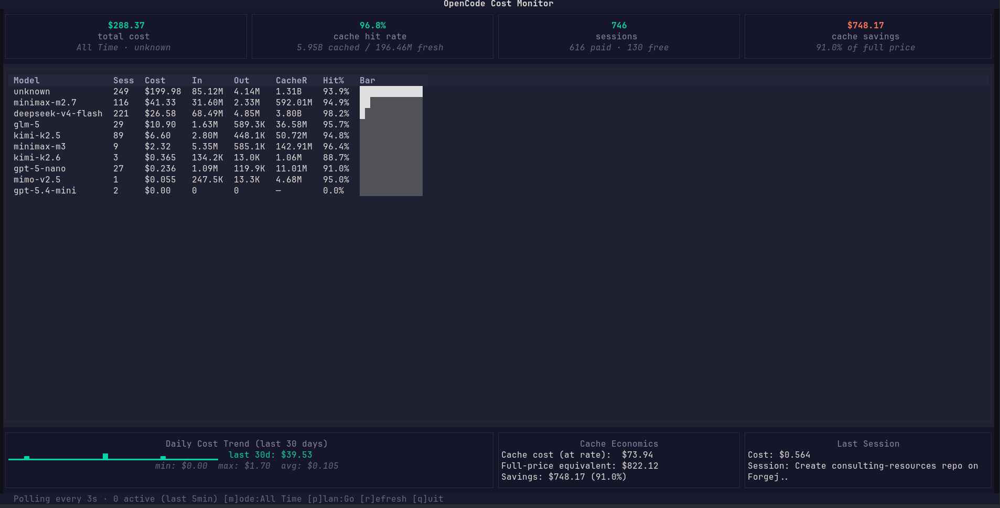

# OpenCode Cost Monitor

Live terminal UI that watches your opencode session database and shows real-time cost stats, model breakdown, cache economics, and daily trends.



## Features

- **Live polling** — reads `opencode.db` every 3 seconds, numbers update as you work
- **Per-model breakdown** — cost, sessions, tokens, cache hit rate with inline bars
- **Cache economics** — hit rate, cost at cache rate vs full-price equivalent, savings
- **Daily trend** — sparkline of last 30 days of spending
- **Time filtering** — press `m` to cycle between All Time / Last 30d / Last 7d / Today
- **Configurable** — set `OPENCODE_DB_PATH` env var or pass `--db` for a custom database location

## Quick Start

```bash
# 1. Create a virtual environment (one-time)
python3 -m venv .venv
.venv/bin/pip install textual

# 2. Run it
./opencode-cost.py
```

The script auto-detects the `.venv` on subsequent runs — just `./opencode-cost.py`.

## Configuration

The database path is resolved in this order:

1. `--db /path/to/opencode.db` (CLI flag)
2. `OPENCODE_DB_PATH` environment variable
3. Default: `~/.local/share/opencode/opencode.db`

```bash
# Via env var
export OPENCODE_DB_PATH=/custom/path/opencode.db
./opencode-cost.py

# Via CLI flag
./opencode-cost.py --db /custom/path/opencode.db
```

## Keybindings

| Key | Action |
|-----|--------|
| `q` | Quit |
| `r` | Refresh now |
| `m` | Cycle time period (All Time / Last 30d / Last 7d / Today) |

## Requirements

- Python 3.12+
- [textual](https://github.com/Textualize/textual) (terminal UI framework)
- An opencode SQLite database at the default path or configured location

## License

MIT
